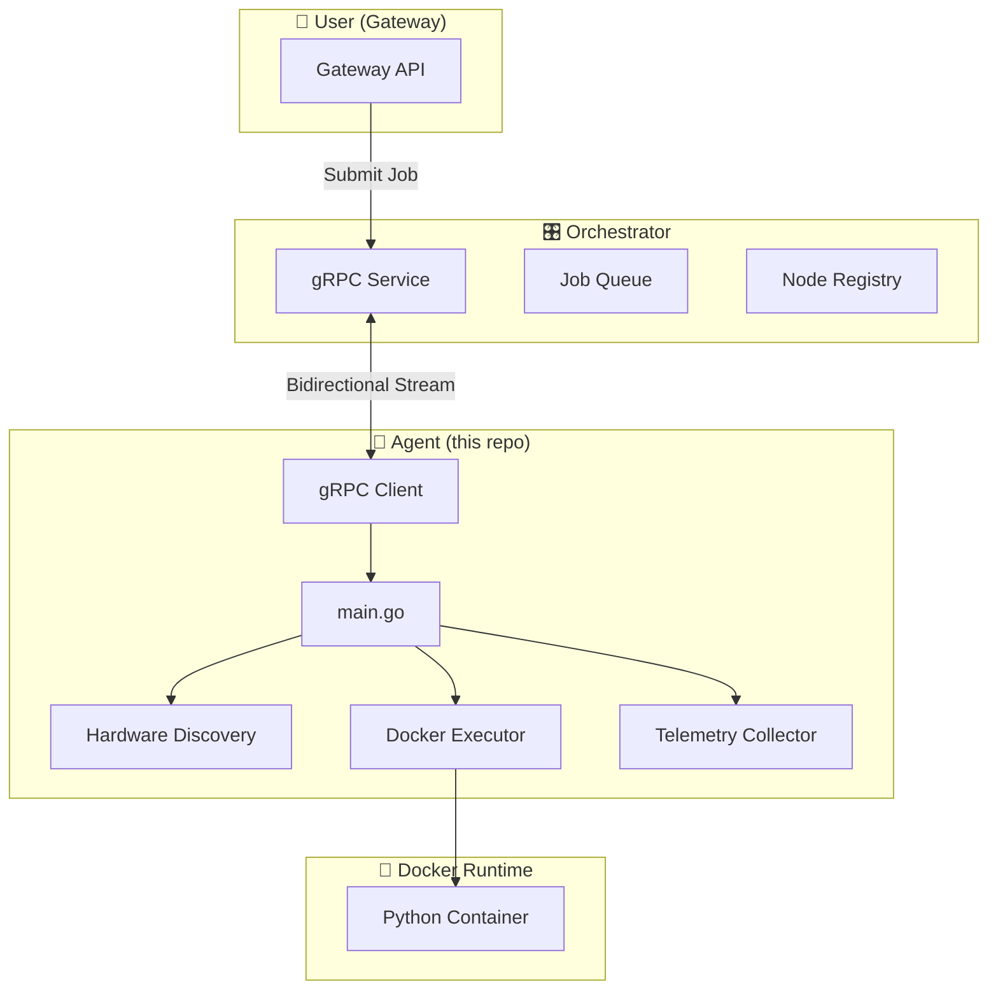
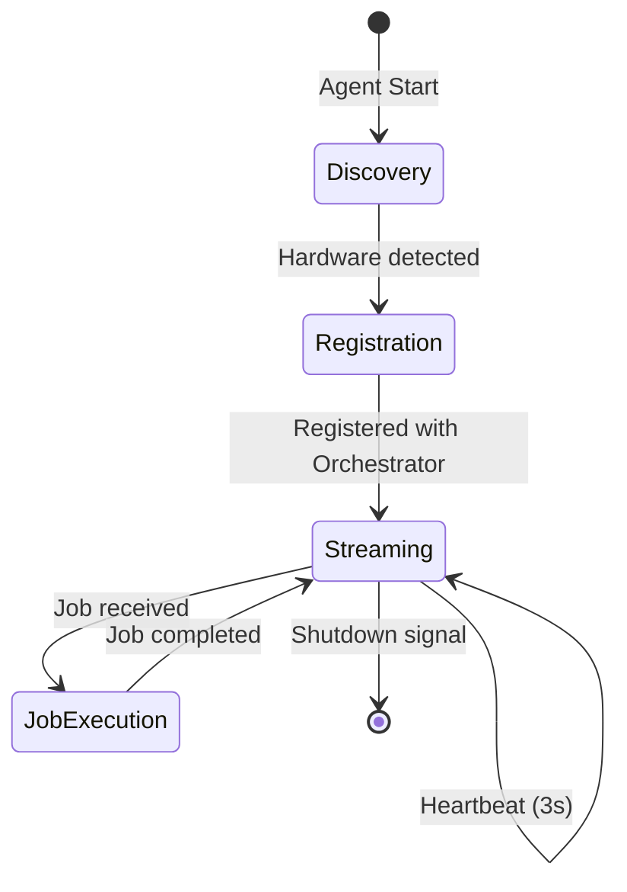
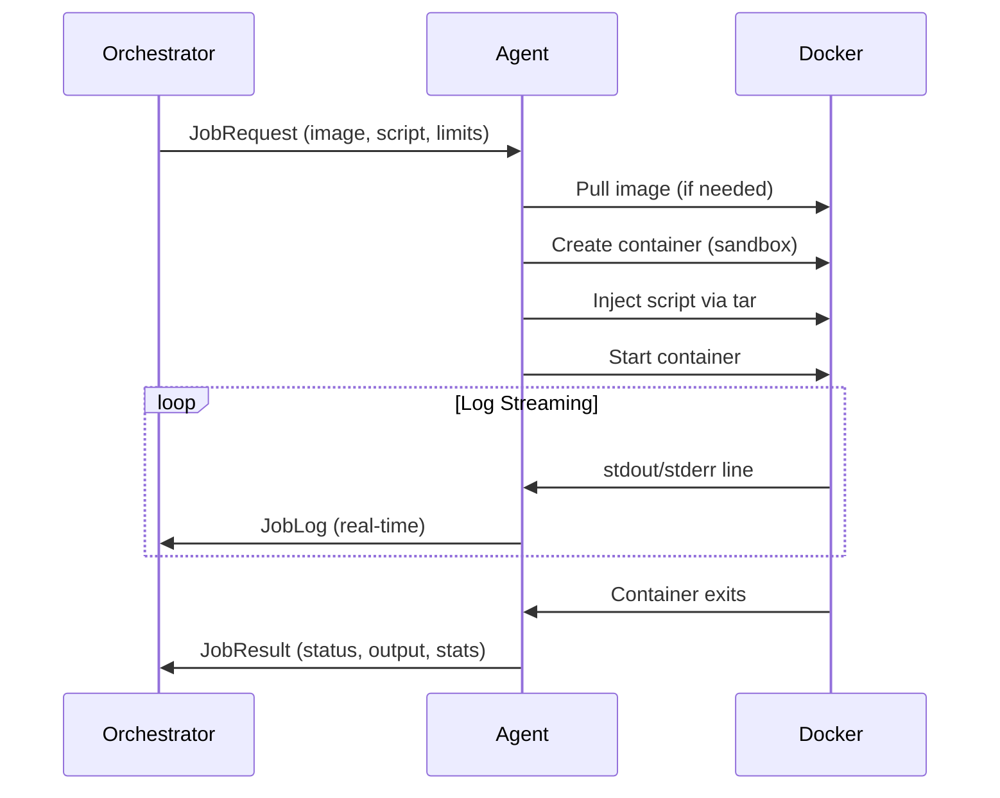

# Nexus Agent Architecture

GPU compute agent for the Nexus decentralized network. Agent'lar, node provider'ların makinelerinde çalışarak Orchestrator'a kayıt olur, heartbeat gönderir ve kullanıcıların job'larını Docker container'larında execute eder.

## System Overview



---

## Core Business Logic

### 1. Node Lifecycle



**Flow:**
1. **Discovery** - CPU, RAM, GPU, Docker bilgileri toplanır
2. **Registration** - Node, Orchestrator'a `NodeInfo` ile kayıt olur
3. **Streaming** - Bidirectional gRPC stream başlar
4. **Heartbeat** - Her 3 saniyede telemetry gönderilir
5. **Job Execution** - Gelen job'lar Docker'da çalıştırılır

### 2. Job Execution Flow



---

## Package Structure

```
agent/
├── cmd/agent/
│   └── main.go              # Entry point, orchestration
├── internal/
│   ├── client/
│   │   └── grpc_client.go   # Orchestrator communication
│   ├── config/
│   │   └── config.go        # Viper-based configuration
│   ├── hardware/
│   │   ├── gpu/             # NVIDIA GPU discovery (NVML)
│   │   └── host/            # CPU/RAM/Disk info (gopsutil)
│   ├── runtime/
│   │   └── docker/          # Container execution
│   └── telemetry/
│       └── collector.go     # Real-time system stats
├── pkg/logger/              # Zap logger wrapper
└── proto/
    └── depin.proto          # gRPC service definitions
```

---

## Module Details

### `main.go` - Entry Point

| Function | Purpose |
|----------|---------|
| `main()` | Config yükle, logger başlat, discovery çalıştır, register & stream |
| `runDiscovery()` | Parallel host/GPU/Docker discovery (WaitGroup) |
| `registerAndStream()` | gRPC bağlantısı, node registration, event stream |
| `createJobHandler()` | Docker executor ile job execution callback |
| `capacityToNodeInfo()` | Discovery sonuçlarını proto mesajına çevir |

### `grpc_client.go` - Orchestrator İletişimi

| Method | Purpose |
|--------|---------|
| `Connect()` | Retry logic ile bağlantı kur |
| `Register()` | NodeInfo gönder, RegistrationResponse al |
| `StreamEvents()` | Bidirectional stream: heartbeat gönder, job al |

**Retry Strategy:** Exponential backoff (1s → 30s max)

### `executor.go` - Docker İşlemleri

| Method | Purpose |
|--------|---------|
| `RunContainer()` | Image pull, container create, script inject, run |
| `injectScript()` | RAM'de tar archive oluştur, container'a kopyala |
| `createContainer()` | Resource limits, security sandbox, network disabled |
| `streamLogs()` | stdout/stderr demux, line-by-line callback |

**Security Sandbox:**
- `NetworkDisabled: true`
- `ReadonlyRootfs: true`
- Capability drops
- PID limit

### `telemetry/collector.go` - Sistem İstatistikleri

Her 3 saniyede toplanan metrikler:
- CPU usage (%)
- RAM usage (%)
- GPU usage (%) - NVML
- VRAM usage/total/free
- System uptime

---

## gRPC Protocol

### Service Definition

```protobuf
service NodeService {
  rpc Register(NodeInfo) returns (RegistrationResponse);
  rpc StreamEvents(stream AgentEvent) returns (stream ServerEvent);
}
```

### Message Types

| Message | Direction | Purpose |
|---------|-----------|---------|
| `NodeInfo` | Agent → Orchestrator | Node registration data |
| `Heartbeat` | Agent → Orchestrator | Real-time telemetry (3s) |
| `JobRequest` | Orchestrator → Agent | Job to execute |
| `JobLog` | Agent → Orchestrator | Real-time log line |
| `JobResult` | Agent → Orchestrator | Final job result |

---

## Configuration

Environment variables (prefix: `AGENT_`) veya `agent.yaml`:

| Key | Default | Description |
|-----|---------|-------------|
| `orchestrator_address` | `trolley.proxy.rlwy.net:23340` | gRPC address |
| `owner_id` | (required) | Clerk User ID (`--owner` flag) |
| `docker_required` | `true` | Fail if Docker unavailable |
| `dev_mode` | `false` | Development logging |
| `log_level` | `info` | debug/info/warn/error |

---

## Cross-Platform Support

| Platform | GPU Support | Build Tag |
|----------|-------------|-----------|
| Linux (CGO) | ✅ NVML | `linux && cgo` |
| Linux (no CGO) | ❌ CPU-only | `linux && !cgo` |
| Windows | ✅ NVML | `windows` |
| macOS | ❌ CPU-only | `!linux && !windows` |
